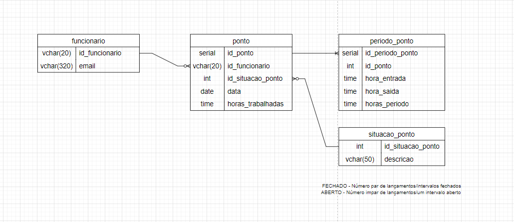

# Infraestrutura do Banco de Dados

## Visão Geral

Este projeto Terraform é projetado para configurar uma infraestrutura AWS robusta, focando na implantação de uma instância de banco de dados PostgreSQL dentro de uma VPC personalizada, utilizando o AWS RDS e o AWS Secrets Manager para o gerenciamento de credenciais. Além disso, configura um RDS Proxy para gerenciar conexões ao banco de dados e melhora a segurança e a escalabilidade.

## Pré-requisitos

- Conta AWS
- Terraform instalado
- Configuração AWS CLI

## Recursos AWS Provisionados

### VPC

aws_vpc.mikes_private_vpc: Cria uma VPC com um bloco CIDR 10.0.0.0/16 para alojar recursos de rede privados.

### Grupo de Sub-redes do Banco de Dados

aws_db_subnet_group.database: Define um grupo de sub-redes para o banco de dados RDS, permitindo que a instância do banco de dados opere em várias zonas de disponibilidade.

### Instância do Banco de Dados

aws_db_instance.database: Implementa uma instância de banco de dados PostgreSQL com configurações especificadas, incluindo tamanho de armazenamento, nome do banco de dados e credenciais de acesso obtidas do AWS Secrets Manager.

### Papéis e Políticas do IAM

aws_iam_role.rds_proxy_role: Cria um papel do IAM para o RDS Proxy assumir.
aws_iam_policy.rds_proxy_policy: Define uma política do IAM que concede permissões necessárias para o RDS Proxy operar, incluindo acesso ao AWS Secrets Manager e conexões ao banco de dados.
aws_iam_role_policy_attachment.rds_proxy_attach: Anexa a política do IAM ao papel do RDS Proxy.

### RDS Proxy

aws_db_proxy.rds_proxy: Configura um RDS Proxy para gerenciar conexões ao banco de dados PostgreSQL, utilizando autenticação baseada em segredos do AWS Secrets Manager.
aws_db_proxy_default_target_group.rds_proxy_tg: Configura o grupo alvo padrão para o RDS Proxy, incluindo configurações de pool de conexões.
aws_db_proxy_target.rds_proxy_target: Define o alvo para o RDS Proxy, conectando-o à instância do banco de dados.

## Variáveis

O projeto utiliza várias variáveis para permitir a personalização da infraestrutura provisionada, incluindo região da AWS, identificadores de sub-rede, identificador da instância do banco de dados, e ARN das credenciais do banco de dados.

## Como Usar

Para utilizar este projeto:

1. Certifique-se de que todos os pré-requisitos estão atendidos.
2. Clone o repositório do projeto para sua máquina local.
3. Navegue até o diretório do projeto e inicialize o Terraform com terraform init.
4. Revise o plano de execução do Terraform com terraform plan para entender as alterações que serão aplicadas.
5. Aplique as configurações com terraform apply e confirme a operação.

## Limpeza

Para remover os recursos provisionados por este projeto, execute terraform destroy no diretório do projeto, confirmando a operação quando solicitado.

## Segurança

- As credenciais do banco de dados são gerenciadas de forma segura pelo AWS Secrets Manager.
- O RDS Proxy melhora a segurança ao gerenciar conexões e autenticação para a instância do banco de dados.

## Tabelas para a solução de Ponto

## Scripts para criação de tabelas

- [Cria tabelas](/sql/cria-tabelas.sql)

- [Adiciona situações](/sql/insere-situacoes.sql)
